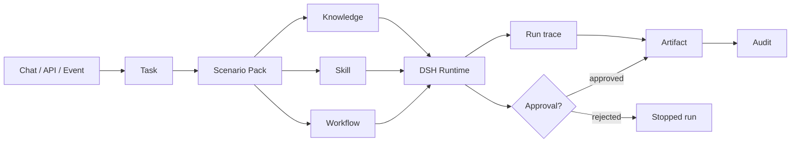

# DSH Workbench

[](https://github.com/yuhangwu97/dsh-workbench/actions/workflows/ci.yml)
[](LICENSE)
[](contracts/openapi.yaml)

> **把业务问题变成可执行任务，把证据、过程和结果留在同一条链路里。**
>
> DSH Workbench 是一个面向企业的开源 AI Task Platform。它提供统一的 Task、Knowledge、Workflow、Skill、Approval 和 Artifact 模型，并把复杂推理交给受限的 DSH Runtime。

> **Turn business requests into accountable work.**
>
> DSH Workbench is an open-source AI Task Platform for teams that need more than a chat window. It gives applications a shared model for Tasks, Knowledge, Workflows, Skills, Approvals, and Artifacts, while DSH handles constrained reasoning and tool orchestration.

[GitHub repository](https://github.com/yuhangwu97/dsh-workbench) · [OpenAPI contract](contracts/openapi.yaml) · [Extension guide](docs/extensions.md) · [Release guide](docs/releasing.md)

## 产品定位 | Product position

Chat 适合开始一个问题，但企业真正需要的是一条可追踪的工作链：谁提交了什么、使用了哪些证据、经过了哪些步骤、调用了哪些工具、是否需要审批、最后产生了什么结果。

Workbench 把这条链路做成公共产品层。它不把模型、向量库或工作流引擎写死在核心里，团队可以从本地 Demo 开始，再替换成自己的 DSH、检索服务、队列和对象存储。

Chat is a useful entry point, but enterprise work needs an accountable chain: what was submitted, which evidence was used, which steps ran, which tools were called, whether a human approved the action, and what result was produced.

Workbench owns that product layer. It keeps the model provider, vector database, workflow engine, queue, and object storage behind replaceable interfaces, so a team can start locally and grow into its own production topology.

## 这套产品解决什么问题 | What it gives a team

| 产品表面 | 用户得到什么 | Product surface | What users get |
| --- | --- | --- | --- |
| **Chat Intake** | 从一句问题开始，自动关联场景包和相关证据 | **Chat Intake** | Start with a question and attach the right scenario and evidence |
| **Task Inbox** | 每个业务请求都有状态、负责人、输入快照和执行记录 | **Task Inbox** | Every request has state, ownership, input, and execution history |
| **Knowledge** | 知识源有范围、有来源、有引用，不把答案和证据混在一起 | **Knowledge** | Sources are scoped and cited instead of being hidden behind an answer |
| **Workflow** | 把检索、Skill、审批和产物组成可复用的过程 | **Workflow** | Compose retrieval, Skills, approvals, and outputs into reusable processes |
| **Run / Approval** | 可以看到运行轨迹，高风险动作先停下来等人确认 | **Run / Approval** | Inspect execution and pause risky actions for human approval |
| **Artifact Library** | 报告、证据包、计划和结构化结果可以长期留存 | **Artifact Library** | Keep reports, evidence bundles, plans, and structured results |

## 三个第一方场景包 | First-party Scenario Packs

| 场景包 | 入口问题 | 主要产物 |
| --- | --- | --- |
| **售后诊断** | 设备日志、故障码、历史工单 | 诊断报告、维修建议、证据包 |
| **研发助手** | Issue、代码上下文、复现信息 | 调查记录、影响范围、Patch Plan |
| **运营告警** | 告警事件、Runbook、影响范围 | 告警摘要、升级建议、审批动作 |

| Pack | Typical input | Typical output |
| --- | --- | --- |
| **After-sales Diagnosis** | Device logs, fault codes, historical tickets | Diagnosis report, repair advice, evidence bundle |
| **Engineering Assistant** | Issues, code context, reproduction data | Investigation record, impact analysis, patch plan |
| **Operations Alerts** | Alert events, runbooks, impact scope | Alert summary, escalation advice, approved action |

Scenario Pack 是产品的业务扩展单元。它可以同时声明 Skills、Knowledge Sources、Workflows、权限策略和审批规则，见 [`packs/after-sales/pack.yaml`](packs/after-sales/pack.yaml)。

A Scenario Pack is the unit of business extension. It declares Skills, Knowledge Sources, Workflows, access policy, and approval rules in one versioned manifest.

## 产品工作流 | Product workflow



产品层负责 Task、租户、权限、审批、Artifact 和审计；DSH Runtime 负责受限推理、工具编排和结构化输出。这个边界让运行时可以更换，而业务数据和产品语义不会跟着迁移。

The product layer owns Tasks, tenants, permissions, approvals, Artifacts, and audit. DSH Runtime owns constrained reasoning, tool orchestration, and structured output. The runtime can change without changing the business model.

## 开发者入口 | Developer surfaces

### 1. HTTP API

公共 API 使用 `/api/v1`，契约在 [`contracts/openapi.yaml`](contracts/openapi.yaml)。API 提供统一错误码、`X-Request-ID`、`Idempotency-Key`、分页、租户上下文和 DSH Callback 签名校验。

The versioned API lives under `/api/v1`. The OpenAPI file is the compatibility source for clients, errors, request tracing, idempotency, pagination, tenant context, and signed DSH callbacks.

### 2. Python SDK

包名：`dsh-workbench`，导入名：`dsh_workbench`。同时提供同步和异步 Client。

```python
from dsh_workbench import DSHClient

client = DSHClient(
    "http://localhost:8766",
    api_key="workspace-token",
    tenant_id="acme",
    actor_id="user-42",
)

task = client.tasks.create(
    name="设备 3021 故障诊断",
    pack_id="after-sales",
    skill_id="equipment-diagnosis",
    input={"device_id": "3021", "fault_code": "E-204"},
)
run = client.tasks.run(task.id)
completed = client.runs.wait(run.id)
artifacts = client.artifacts.list(task_id=task.id)
```

### 3. TypeScript SDK

包名：`@dsh-workbench/sdk`，基于原生 Fetch，不绑定 React、Vue 或 Node 框架。

```ts
import { DSHClient } from '@dsh-workbench/sdk';

const client = new DSHClient({
  baseUrl: 'http://localhost:8766',
  apiKey: 'workspace-token',
  tenantId: 'acme',
  actorId: 'user-42',
});

const task = await client.tasks.create({
  name: '设备 3021 故障诊断',
  packId: 'after-sales',
  skillId: 'equipment-diagnosis',
  input: { device_id: '3021', fault_code: 'E-204' },
});
const run = await client.tasks.run(task.id);
const completed = await client.runs.wait(run.id);
```

两套 SDK 共享 OpenAPI 和 JSON Schema，资源字段、状态机和错误模型保持一致。

Both SDKs share the same OpenAPI and JSON Schema contracts, so resource fields, state transitions, and errors stay aligned across languages.

### 4. 扩展协议 | Extension protocols

不改核心服务，也可以替换基础设施：

- `KnowledgeProvider`：接入 pgvector、Elasticsearch、Milvus 或内部搜索
- `SkillProvider`：接入企业内部工具和业务动作
- `WorkflowExecutor`：接入 DSH、Temporal、LangGraph 或自研执行器
- `ArtifactStore`：接入 S3、OSS、MinIO 或本地对象存储
- `ApprovalPolicy`：按租户、资源和动作定义审批规则
- `EventSink`：接入 Kafka、Webhook、审计和指标管道

The extension surface lets teams replace infrastructure without forking the domain model. See [`docs/extensions.md`](docs/extensions.md) for the provider contracts and safety boundary.

## 五分钟启动 | Five-minute start

### 本地参考服务 | Local reference service

```bash
git clone https://github.com/yuhangwu97/dsh-workbench.git
cd dsh-workbench
python3 server.py --port 8766
```

打开 <http://127.0.0.1:8766/>。默认使用 `local-demo` runtime 和 JSON 状态文件，适合快速体验产品链路。

Open <http://127.0.0.1:8766/>. The default `local-demo` runtime and JSON state are intended for a fast product walkthrough.

### Docker Compose

```bash
cp .env.example .env
# 设置 WORKBENCH_AUTH_TOKEN；真实 DSH 可填写 DSH_ENDPOINT
docker compose up -d --build
```

Compose 默认使用 SQLite 持久化并暴露 `/api/v1/health` 和 `/api/v1/ready` 探针。

Compose uses SQLite persistence by default and exposes `/api/v1/health` and `/api/v1/ready` probes.

### 从仓库安装 SDK | Install SDKs from the repository

```bash
python -m pip install -e packages/python
npm install ./packages/typescript
```

本仓库已经准备好构建 wheel 和 npm tarball；PyPI/npm 正式发布步骤见 [`docs/releasing.md`](docs/releasing.md)。

The repository is ready to build a Python wheel and an npm tarball. See [`docs/releasing.md`](docs/releasing.md) for publishing steps.

## 安全和生产边界 | Security and production boundary

当前参考服务已经支持：

- Bearer Token 保护 API
- `tenant_id` / `actor_id` 上下文
- 基础租户隔离
- Task / Run / Artifact 审计记录
- 高风险动作的 Approval 状态
- DSH Callback HMAC 签名校验
- 受限工具白名单、禁止 shell 和受限文件系统策略

生产部署还需要按团队环境接入 OIDC/JWT、托管数据库、队列、对象存储、真实知识库和 DSH endpoint。参考服务的 `local-demo` 执行器不会伪装成真实模型推理。

The reference service already includes bearer auth, tenant context, audit records, approval states, signed callbacks, restricted tools, and a deny-by-default runtime policy. Production deployments should add OIDC/JWT, a managed database, a queue, object storage, a real knowledge provider, and a configured DSH endpoint.

## 当前版本 | Current status

**v0.1.0 · Framework foundation**

已交付：

- 官方 Workbench 控制台和参考服务
- OpenAPI / JSON Schema 契约
- Python 同步/异步 SDK
- TypeScript SDK
- Scenario Pack manifest
- 扩展协议和示例
- Docker、Compose、CI、测试和发布文档

Shipped in this foundation release:

- Official Workbench console and reference service
- OpenAPI / JSON Schema contracts
- Python sync/async SDK
- TypeScript SDK
- Scenario Pack manifest
- Extension protocols and examples
- Docker, Compose, CI, tests, and release documentation

## 路线图 | Roadmap

- [ ] 将参考服务拆成可替换的 API、Worker 和 Provider 进程
- [ ] 增加真实 Knowledge ingestion、Embedding 和引用追踪
- [ ] 增加队列、重试、取消和并发配额
- [ ] 增加 OIDC/JWT、组织成员和细粒度权限
- [ ] 发布到 PyPI 和 npm
- [ ] 建立 Scenario Pack 注册和评测体系

The next milestones are production workers, real knowledge ingestion, queue-backed execution, enterprise identity, public SDK releases, and a Scenario Pack registry with evaluations.

## 目录 | Repository map

| Path | Responsibility |
| --- | --- |
| `index.html`, `styles.css`, `app.js` | Workbench console |
| `server.py` | Dependency-free reference API and static server |
| `runtime/` | DSH runtime boundary |
| `contracts/` | OpenAPI and JSON Schema contracts |
| `packages/python/` | Python SDK and provider Protocols |
| `packages/typescript/` | TypeScript SDK and provider interfaces |
| `packs/` | Scenario Pack manifests |
| `examples/` | Python and TypeScript integration examples |
| `tests/` | Contract, server, runtime, and SDK tests |
| `docs/` | Architecture, extensions, and release guides |

## Contributing

欢迎提交 Issue、Scenario Pack、Provider 实现和文档改进。新增公共字段时，请先更新 OpenAPI/JSON Schema，再同步 Python/TypeScript SDK，并补充兼容性测试。

Contributions are welcome, especially new Scenario Packs, providers, integration examples, and documentation. When adding a public field, update OpenAPI/JSON Schema first, then update both SDKs and add compatibility tests.

```bash
make test
```

## License

Apache-2.0. See [`LICENSE`](LICENSE).
