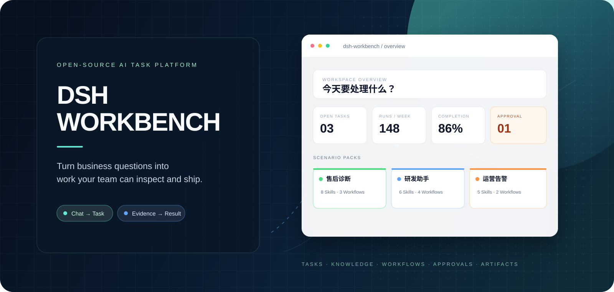
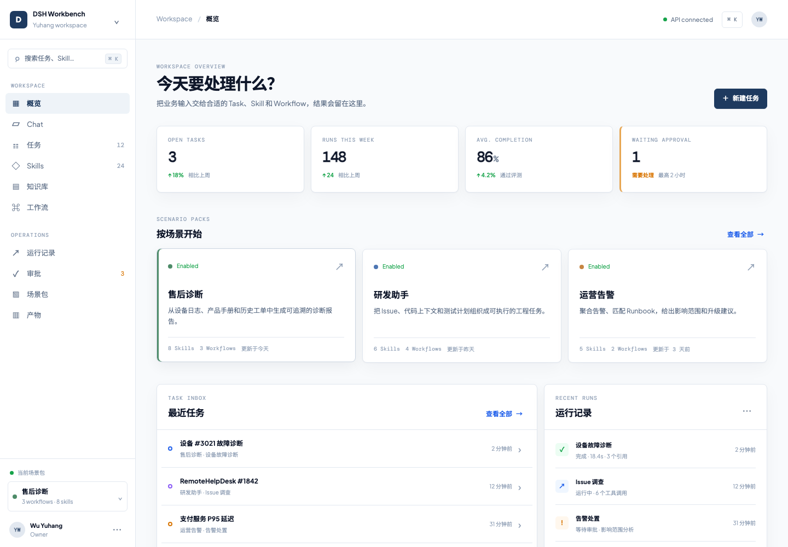
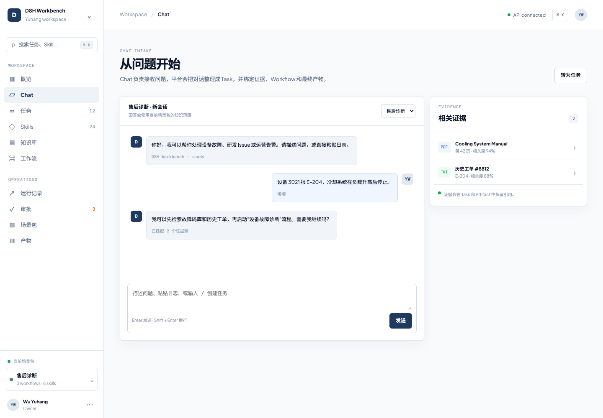
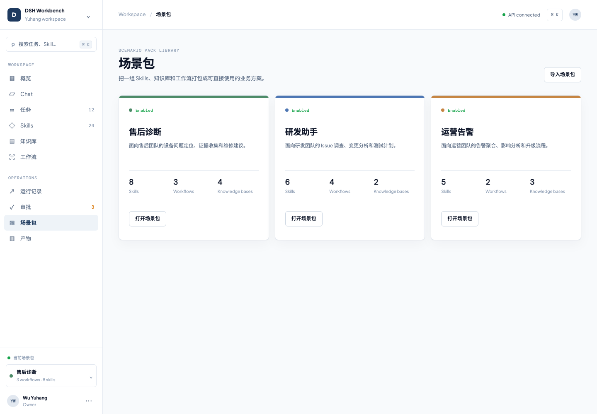
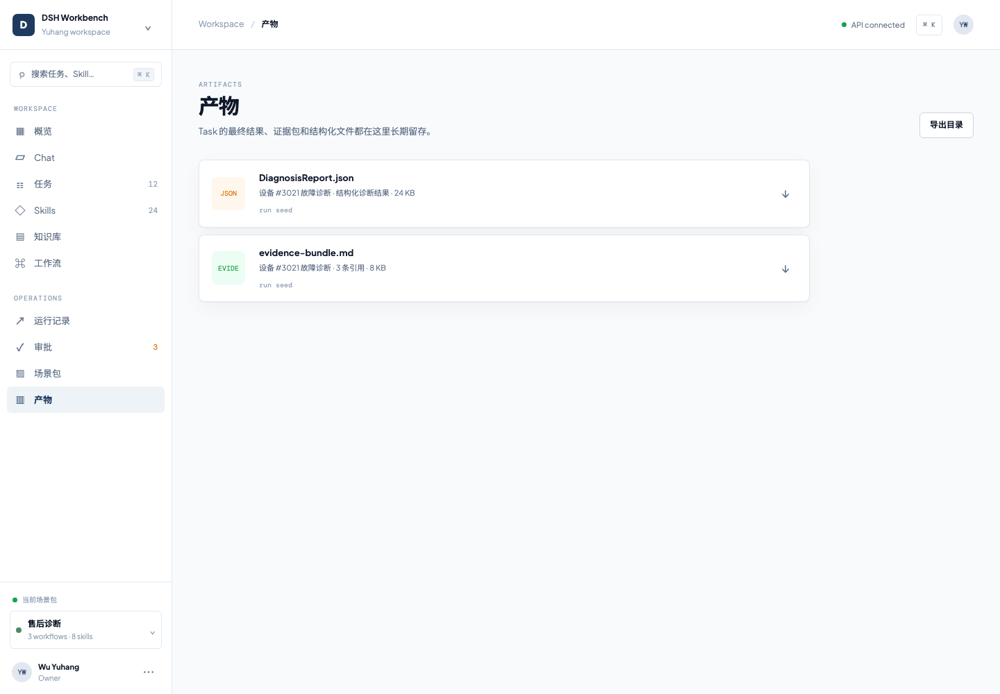
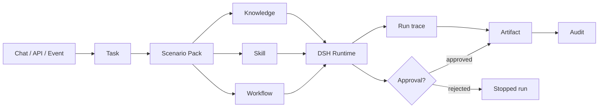

# DSH Workbench

<div align="center">

[](https://github.com/yuhangwu97/dsh-workbench/actions/workflows/ci.yml)
[](LICENSE)
[](contracts/openapi.yaml)



**企业 AI 任务平台 · Open-source AI Task Platform**<br>
把一句业务问题，变成一条有证据、有状态、可交付的工作链。

[打开仓库](https://github.com/yuhangwu97/dsh-workbench) · [运行本地 Demo](#五分钟看到产品--see-the-product-in-five-minutes) · [查看 API](contracts/openapi.yaml) · [开始扩展](docs/extensions.md)

</div>



<p align="center"><sub>Reference workspace · Overview / 概览</sub></p>

## 这是什么 | The product

企业里的 AI 工作很少停在“回答一句话”。它通常要继续检索资料、调用工具、走审批、留下引用，并交付一份可以复查的结果。Workbench 把这些动作放在同一个工作区里，让每个请求都有明确的输入、过程、责任人和产物。

AI work in a company rarely ends with one answer. It usually needs source material, tools, approval, citations, and a result someone else can review. Workbench keeps that chain in one workspace, with a durable input, run history, ownership, and output for every request.

### 产品里有什么 | What is in the workspace

| 产品入口 | 你可以做什么 | Product surface | What it is for |
| --- | --- | --- | --- |
| **Chat** | 从自然语言问题开始，随时转成 Task | **Chat** | Start from a question and turn it into a Task |
| **Tasks** | 看状态、负责人、输入快照和下一步 | **Tasks** | Track state, ownership, input, and next action |
| **Knowledge** | 管理有范围、有来源、可引用的资料 | **Knowledge** | Keep scoped, sourced, citable knowledge |
| **Workflow** | 把检索、Skill、审批和产物串成过程 | **Workflow** | Compose retrieval, Skills, approvals, and outputs |
| **Runs** | 看到每一步执行和工具调用 | **Runs** | Inspect each execution step and tool call |
| **Approvals** | 在真实业务写入前让人确认 | **Approvals** | Confirm high-impact actions before they write |
| **Artifacts** | 留下报告、证据包、计划和结构化结果 | **Artifacts** | Preserve reports, evidence bundles, plans, and structured results |

## 三个可以直接开始的场景 | Three scenario packs

Workbench 的第一版不是一个空白的聊天框，而是三个带有业务入口的 Scenario Pack。每个 Pack 都可以声明自己的 Skills、Knowledge Sources、Workflow、权限和审批规则。

The first release starts with three concrete Scenario Packs. Each pack can declare its Skills, Knowledge Sources, Workflows, permissions, and approval rules in one versioned manifest.

| 场景 | 从哪里开始 | 最后得到什么 |
| --- | --- | --- |
| **售后诊断** | 设备日志、故障码、历史工单 | 诊断报告、维修建议、证据包 |
| **研发助手** | Issue、代码上下文、复现信息 | 调查记录、影响范围、Patch Plan |
| **运营告警** | 告警事件、Runbook、影响范围 | 告警摘要、升级建议、审批动作 |

| Pack | Start with | Finish with |
| --- | --- | --- |
| **After-sales Diagnosis** | Device logs, fault codes, historical tickets | Diagnosis report, repair advice, evidence bundle |
| **Engineering Assistant** | Issues, code context, reproduction data | Investigation record, impact analysis, patch plan |
| **Operations Alerts** | Alert events, runbooks, impact scope | Alert summary, escalation advice, approved action |

## 产品界面 | Product tour

真实的工作链会在三个地方展开：Chat 负责收集上下文，Scenario Pack 负责给出业务边界，Artifact Library 负责让结果可以被复查和复用。

The product has three visible moments: Chat captures context, Scenario Packs set the business boundary, and the Artifact Library keeps the outcome reviewable and reusable.

<details open>
<summary><strong>01 · Chat + evidence / 对话与证据</strong></summary>



<p align="center"><sub>问题、场景包和证据源在同一个上下文里。</sub></p>
</details>

<details open>
<summary><strong>02 · Scenario Packs / 场景包</strong></summary>



<p align="center"><sub>每个场景包都把 Skills、Workflows 和 Knowledge 组合成一个可使用的入口。</sub></p>
</details>

<details open>
<summary><strong>03 · Artifacts / 结果产物</strong></summary>



<p align="center"><sub>报告、证据包和 Patch Plan 会跟着 Task 长期留存。</sub></p>
</details>

## 一条完整的工作链 | One accountable run



产品层负责 Task、租户、权限、审批、Artifact 和审计；DSH Runtime 负责受限推理、工具编排和结构化输出。你可以替换运行时、检索服务、队列或对象存储，而不必重写产品语义。

The product layer owns Tasks, tenants, permissions, approvals, Artifacts, and audit. DSH Runtime owns constrained reasoning, tool orchestration, and structured output. Replace the runtime, search service, queue, or object store without rewriting the product model.

## 给团队的价值 | Why teams use it

- **从聊天到工作**：对话不会停在消息列表里，而是可以转成有状态的 Task。
- **证据跟着结果走**：知识来源、引用和 Artifact 保持在同一条链路中。
- **业务动作有人把关**：写工单、升级告警、修改配置等动作可以先停在 Approval。
- **运行时可以替换**：核心产品模型不绑定某个模型、向量库或工作流引擎。

- **From chat to work**: a conversation can become a stateful Task.
- **Evidence travels with the result**: sources, citations, and Artifacts stay linked.
- **Human control at the boundary**: write operations can pause for Approval.
- **Replaceable runtime**: the product model stays independent of a model, vector store, or workflow engine.

## 五分钟看到产品 | See the product in five minutes

```bash
git clone https://github.com/yuhangwu97/dsh-workbench.git
cd dsh-workbench
python3 server.py --port 8766
```

打开 <http://127.0.0.1:8766/>，你会看到 Overview、Chat、Tasks、Knowledge、Workflow、Approvals 和 Artifacts。默认的 `local-demo` runtime 使用本地 JSON 状态，适合体验完整链路。

Open <http://127.0.0.1:8766/> to explore Overview, Chat, Tasks, Knowledge, Workflow, Approvals, and Artifacts. The default `local-demo` runtime uses local JSON state for a fast end-to-end walkthrough.

如果你希望用 Docker 启动：

```bash
cp .env.example .env
# 设置 WORKBENCH_AUTH_TOKEN；真实 DSH 可填写 DSH_ENDPOINT
docker compose up -d --build
```

## 给开发者的扩展面 | Build on the platform

### Python SDK

```python
from dsh_workbench import DSHClient

client = DSHClient(
    "http://localhost:8766",
    api_key="workspace-token",
    tenant_id="acme",
    actor_id="user-42",
)

task = client.tasks.create(
    name="设备 3021 故障诊断",
    pack_id="after-sales",
    skill_id="equipment-diagnosis",
    input={"device_id": "3021", "fault_code": "E-204"},
)
run = client.tasks.run(task.id)
completed = client.runs.wait(run.id)
artifacts = client.artifacts.list(task_id=task.id)
```

### TypeScript SDK

```ts
import { DSHClient } from '@dsh-workbench/sdk';

const client = new DSHClient({
  baseUrl: 'http://localhost:8766',
  apiKey: 'workspace-token',
  tenantId: 'acme',
  actorId: 'user-42',
});

const task = await client.tasks.create({
  name: '设备 3021 故障诊断',
  packId: 'after-sales',
  skillId: 'equipment-diagnosis',
  input: { device_id: '3021', fault_code: 'E-204' },
});
const run = await client.tasks.run(task.id);
await client.runs.wait(run.id);
```

Python 和 TypeScript SDK 共享 OpenAPI 与 JSON Schema，资源字段、状态机和错误模型保持一致。Provider 接口可以接入知识库、业务工具、工作流执行器、对象存储和事件管道，详见 [`docs/extensions.md`](docs/extensions.md)。

Python and TypeScript SDKs share the OpenAPI and JSON Schema contracts. Provider interfaces cover knowledge, business tools, workflow execution, artifact storage, and event sinks. See [`docs/extensions.md`](docs/extensions.md).

## 当前版本 | Current status

**v0.1.0 · Framework foundation**

已经包含：参考控制台、API 与 Schema 契约、Python/TypeScript SDK、Scenario Pack manifest、Provider 扩展接口、Docker、CI 和测试。

Ships today: the reference console, API and Schema contracts, Python/TypeScript SDKs, Scenario Pack manifests, Provider interfaces, Docker, CI, and tests.

生产环境还需要接入 OIDC/JWT、托管数据库、队列、对象存储、真实 Knowledge Provider 和 DSH endpoint。参考服务的 `local-demo` 执行器用于产品体验，不冒充真实模型推理。

For production, add OIDC/JWT, a managed database, a queue, object storage, a real Knowledge Provider, and a configured DSH endpoint. The `local-demo` executor is for product walkthroughs; it does not pretend to be model inference.

## 接下来 | Next milestones

- [ ] 真实 Knowledge ingestion、Embedding 和引用追踪
- [ ] 队列、重试、取消和并发配额
- [ ] OIDC/JWT、组织成员和细粒度权限
- [ ] 发布到 PyPI 和 npm
- [ ] Scenario Pack 注册和评测体系

## 仓库结构 | Repository map

| Path | Responsibility |
| --- | --- |
| `index.html`, `styles.css`, `app.js` | Workbench console |
| `server.py` | Dependency-free reference API and static server |
| `runtime/` | DSH runtime boundary |
| `contracts/` | OpenAPI and JSON Schema contracts |
| `packages/python/` | Python SDK and provider Protocols |
| `packages/typescript/` | TypeScript SDK and provider interfaces |
| `packs/` | Scenario Pack manifests |
| `examples/` | Python and TypeScript integration examples |
| `tests/` | Contract, server, runtime, and SDK tests |
| `docs/` | Architecture, extension, and release guides |

## 参与贡献 | Contributing

欢迎提交 Issue、Scenario Pack、Provider 实现、集成示例和文档改进。新增公共字段时，请先更新 OpenAPI/JSON Schema，再同步两套 SDK，并补充兼容性测试。

Contributions are welcome: Scenario Packs, Provider implementations, integration examples, and product improvements. When adding a public field, update OpenAPI/JSON Schema, sync both SDKs, and add compatibility coverage.

```bash
make test
```

## License

Apache-2.0. See [`LICENSE`](LICENSE).
